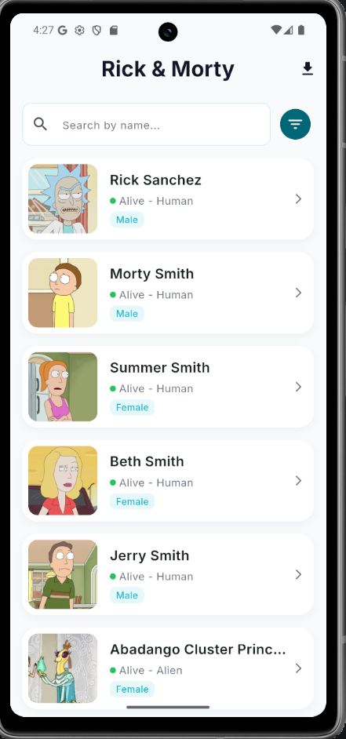
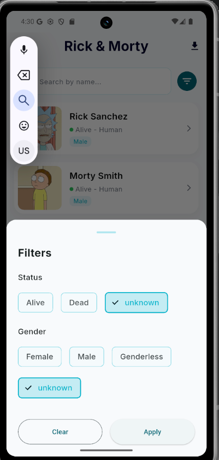
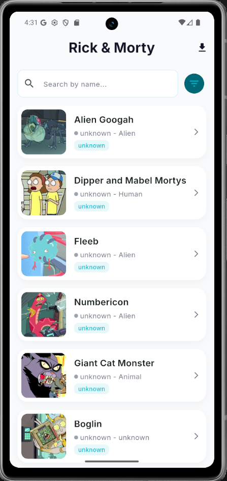
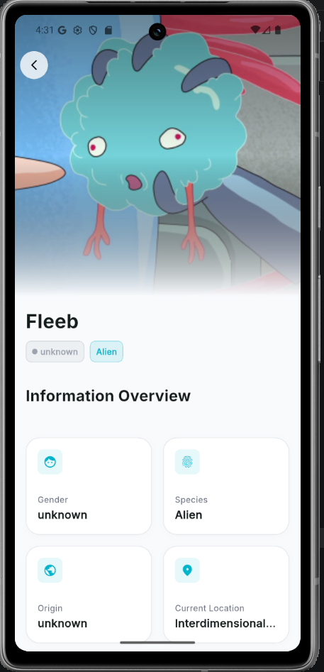
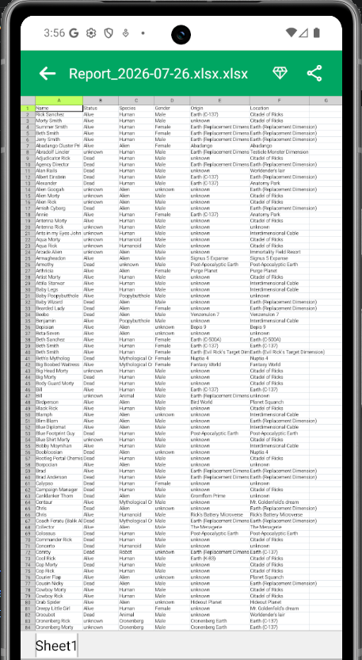

# Rick & Morty Explorer

A Flutter application built as part of the **EASY WORLD Flutter Internship Task**.

The app integrates with the Rick and Morty API to browse, search, filter, and export character data while following Clean Architecture principles and using Cubit for state management.

---

## ✨ Features

- Browse all characters
- Infinite Pagination
- Search characters by name
- Filter by Status
- Filter by Gender
- Character Details Screen
- Export characters to Excel (.xlsx)
- Pull to Refresh
- Loading, Empty and Error States
- Responsive UI
- Clean and Reusable Components

---

## 🛠 Tech Stack

- Flutter
- Cubit (flutter_bloc)
- Dio
- Retrofit
- GetIt
- Clean Architecture
- Cached Network Image
- Excel Package

---

## 📂 Project Structure

```text
lib
│
├── core
│   ├── di
│   ├── network
│   ├── routing
│   ├── services
│   ├── theme
│   └── widgets
│
├── features
│   └── character
│       ├── data
│       ├── domain
│       └── presentation
│
└── main.dart
```

---

## 📱 Screenshots

### Home



### Search


### Filters




### Character Details



### Export Excel



---

## 🎥 Demo Video

Watch the application demo here:

**Video Link:**

https://drive.google.com/drive/u/3/folders/1oVsU1I8SqDglSOSXXaOlpIJkqAqGtqZu

---

## 🌐 API

Rick and Morty API

https://rickandmortyapi.com/

---

## 🚀 Getting Started

Clone the repository

```bash
git clone https://github.com/AnwaarMohamd/easyworld_app#eazyworld_app
```

Go to the project

```bash
cd YOUR_REPOSITORY
```

Install packages

```bash
flutter pub get
```

Run the application

```bash
flutter run
```

---

## 📦 Dependencies

Some of the main packages used:

- flutter_bloc
- dio
- retrofit
- get_it
- cached_network_image
- flutter_screenutil
- excel
- path_provider
- shimmer
- equatable

---

## 📌 Notes

- Built following Clean Architecture principles.
- Uses Cubit for state management.
- Supports pagination and server-side search.
- Includes loading, empty and error states.
- Data can be exported as an Excel (.xlsx) file.

---

## 👨‍💻 Author

**Anwaar Mohamed**

Flutter Developer